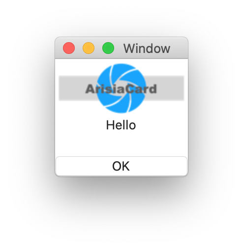

# `Icon` component

## Introduction
Clickable Icon.

This is sample view of Icon:
(The "OK" button is NOT an icon component.)

## Interface

This is the interface definition for TypeScript:
<pre>
interface IconIF extends FrameIF {
  pressed(p0: FrameIF): void ;
  size: SymbolSize ;
  symbol: string ;
  title: string ;
}
declare function _alloc_Icon(): IconIF ;

</pre>

# Related links
* [Arisia Platform](https://github.com/steelwheels/Arisia#readme)
* [Steel Wheels Project](https://github.com/steelwheels)

