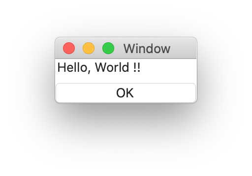

# `Label` component

## Introduction
Display text/number field

## Interface

This is the interface definition for TypeScript:
<pre>
interface LabelIF extends FrameCoreIF {
  frameName: string ;
  number: number ;
  propertyNames: string[] ;
  text: string ;
}
declare function _alloc_Label(): LabelIF ;

</pre>

## Sample
<pre>
{
  label: Label {
    text: string "Hello, World !!"
  }
  ok_button: Button {
        title: string "OK"
        pressed: event() %{
	    	leaveView(0) ;
        %}
  }
}

</pre>

### Sample screenshot (macOS)

For more details, see [hello.jspkg](https://github.com/steelwheels/Arisia/tree/main/ArisiaCard/Resource/Samples/hello.jspkg).

# Related links
* [Arisia Platform](https://github.com/steelwheels/Arisia#readme)
* [Steel Wheels Project](https://github.com/steelwheels)

