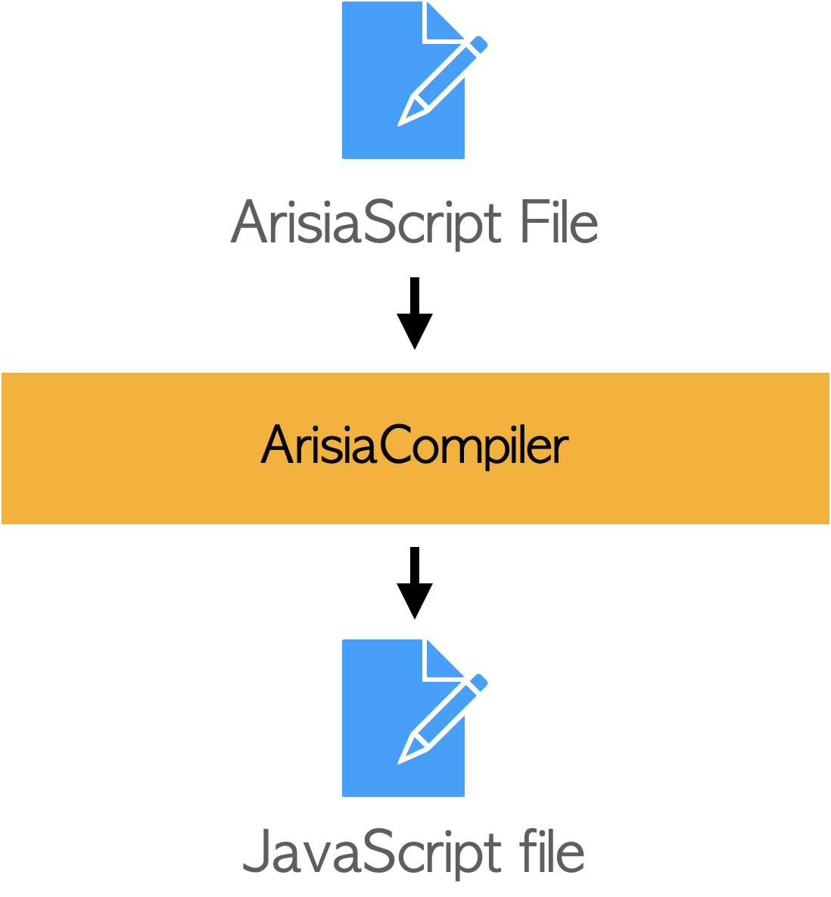

# Arisia Programming Environment

<div style="text-align: center">

</div>

## Introduction
The *Arisia Programming Environment* is application software development environment.

It targetss on *rappid GUI application development*
and the sloga is
<div style="text-align: center">

</div>

To reduce the amount code to implement the application.
this environment has following features:
* Programming based on event driven software architecture. The [ArisiaScript language](#arisiascript-language) support it at the syntax level.
* [ArisiaLibrary](#arisia-library) has many predefined components to implement GUI application which uses database access.

This environment assumes the platform allows the application to execute the JavaScript code in it. 
Now, the targets platforms are:
* macOS
* iOS

## ArisiaScript language
The *ArisiaScript* extends the syntax of [TypeScript](https://www.typescriptlang.org) to support [frame](#frame) declaration.

This is the feature of this language:
* Support event driven programming

### Frame
The arisia script defines the *frame*. It is the super class of all objects. 
The frame will have following items to support event driven programming.
* Observable properties
* Listner methods

This is sample frame implementation:
````
{
        // property variable
        member_a : number 0
}
````

### Component
The component is the class which inherit the frame class.
It is used to implement the following parts of the application:
* GUI parts
* Database access modules

# Arisia Compiler
The [arisia compiler](#ArisiaCompiler) and TypeScript compiler (`tsc`) convert the arisia script into JavaScript. 
<div style="text-align: center">
  
</div>

note: The TypeScript compiler is contained in a [NPM package](https://www.npmjs.com/package/typescript).
This project *DOES NOT* distribute it.

## Arisia Library
The arisia library contains many kind of [components](#component).

### Built-in native component
### Built-in script component
### User defined component

## Arisia Runtime

# Related links
* [Steel Wheels Project](https://github.com/steelwheels)
