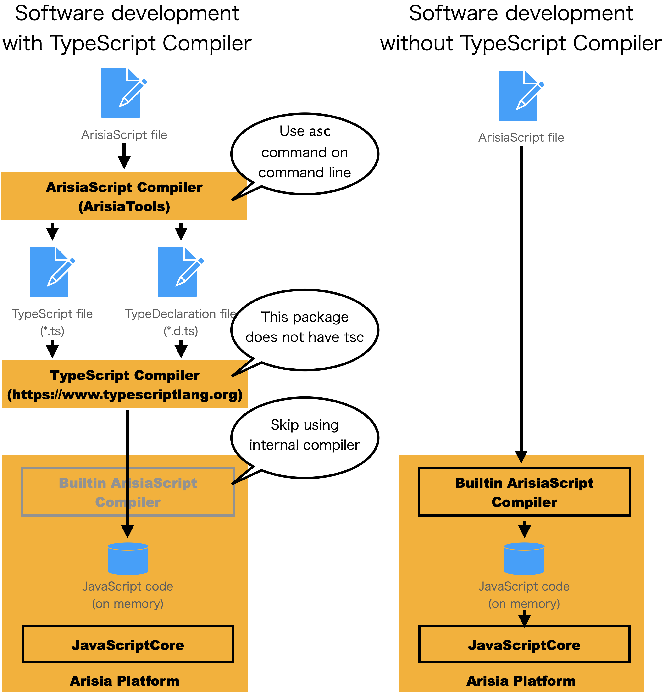

# Arisia Platform

<p align="center">

</p>

## Introduction
The *Arisia Platform* is the software platform for the rapid application software development.

For rapid application development, the following matters are required:
* The programming language that allows writing your ideas directory.
* Rich built-in components that eliminate the needs to reinvent the wheel
* The platform which supports multiple target OS and hardware

This platform has following features to meet these requirements:
* Extend the TypeScript syntax to support event driven programming. The language is named [ArisiaScript](#arisiascript-language).
* Usual GUI parts are implemented as built-in components. See [component list](./Document/arisia-components.md).
* The application designed for Arisia Platform runs on [macOS](https://www.apple.com/macos/) and [iOS](https://www.apple.com/ios/). 

## Sample screen shot
This is a simple example of ArisiaScript program.
````
{
  button: Button {
    title: string "Hello, world !!"
    pressed: event() %{
      console.log("Pressed") ;
    %}
  }
}
````
There are sample screen shots which is executed on MacOS and iOS.

<p align="center">

</p>

## License
Copyright (C) 2014-2022 [Steel Wheels Project](http://steelwheels.github.io).
This software is distributed under [GNU LESSER GENERAL PUBLIC LICENSE Version 2.1](https://www.gnu.org/licenses/lgpl-2.1-standalone.html) and the document is distributed under [GNU Free Documentation License](https://www.gnu.org/licenses/fdl-1.3.en.html).

## Dowload
* Source code: https://github.com/steelwheels
* AooStore: Not released yet

## ArisiaScript language
The *ArisiaScript* extends the syntax of [TypeScript](https://www.typescriptlang.org) to support [frame](#frame) declaration.
For more details, see [ArisiaScript language specification](./Document/arisia-lang.md).

### Overview of the Frame
The arisia script defines the *frame*. It is the super class of all objects. 
The frame will have following items to support event driven programming.
* Observable properties
* Listner methods

This is sample frame implementation:
````
{
  ok_button: Button {
    title: string "OK"
    pressed: event() %{
      console.log("Button pressed")
    %}
  }
}
````

## Arisia Component
See the [component list](./Document/arisia-components.md).

## Arisia Library
Many built-in classes, functions and data types are supported. See the [Kiwi Standard Library](https://github.com/steelwheels/KiwiScript/blob/master/KiwiLibrary/Document/Library.md).

## Software development environment
### Compile flow
The Arisia Platform recommends to use TypeScript to implement the user logic.

<p align="center">

</p>

# References
* [Implementation](./Document/arisia-implementation.md): The implementation of this software

# Related links
* [Steel Wheels Project](https://github.com/steelwheels)
* [ArisiaTools](https://github.com/steelwheels/Arisia/tree/main/ArisiaTools): Command line tools for development 
* Arisia: The name of the star in the novel [lensman](https://en.wikipedia.org/wiki/Lensman_series)

