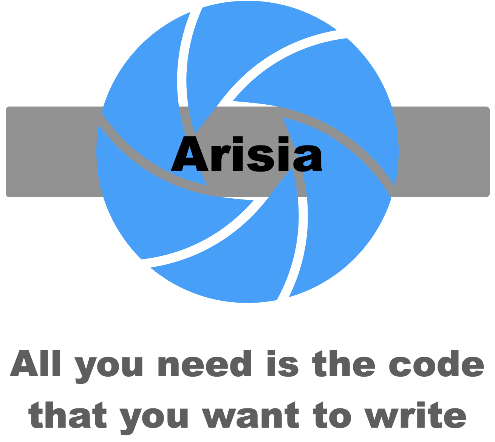
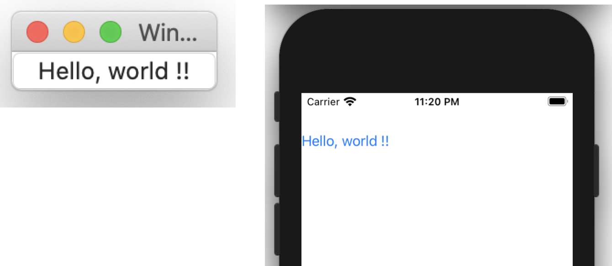

# Arisia Platform

<p align="center">

</p>

## Introduction
The *Arisia Platform* is the software platform for the rapid application software development.
The [ArisiaCard](./ArisiaCard/README.md) is an implementation of it.

For rapid application development, the following matters are required:
* The programming language that allows writing your ideas directory.
* Rich built-in components that eliminate the needs to reinvent the wheel
* The platform which supports multiple target OS and hardware

This platform has following features to meet these requirements:
* Extend the TypeScript syntax to support event driven programming. The language is named [ArisiaScript](./Document/arisia-lang.md).
* Usual GUI parts are implemented as built-in components. See [component list](./Document/arisia-components.md).　And there are some classes and functions to control them, see [Arisia Library](./Document/arisia-library.md).
* The application designed for Arisia Platform runs on [macOS](https://www.apple.com/macos/) and [iOS](https://www.apple.com/ios/). 

## Sample screen shot
This is a simple example of ArisiaScript program.
````
{
  button: Button {
    title: string "Hello, world !!"
    pressed: event() %{
      console.log("Pressed") ;
    %}
  }
}
````
There are sample screen shots which is executed on MacOS and iOS.

<p align="center">

</p>

## License
Copyright (C) 2014-2022 [Steel Wheels Project](http://steelwheels.github.io).
This software is distributed under [GNU LESSER GENERAL PUBLIC LICENSE Version 2.1](https://www.gnu.org/licenses/lgpl-2.1-standalone.html) and the document is distributed under [GNU Free Documentation License](https://www.gnu.org/licenses/fdl-1.3.en.html).

## Dowload
* Source code: https://github.com/steelwheels
* AooStore: Not released yet

## Documentations
* [ArisiaScript](./Document/arisia-lang.md): The language specification of *ArisiaScript*. 
* [component list](./Document/arisia-components.md): The list of built-in components. It supports GUI and database programming.
* [Arisia Library](./Document/arisia-library.md): The built-in functions to support Arisia Platform.
* [Kiwi Standard Library](https://github.com/steelwheels/KiwiScript/blob/master/KiwiLibrary/Document/Library.md): General purpose JavaScript (coded by TypeScript) library.
* [Implementation](./Document/arisia-implementation.md): The implementation of this software

# Related links
* [Steel Wheels Project](https://github.com/steelwheels): The developper of this product.
* [ArisiaCard](./ArisiaCard/README.md): The implementation of Arisia Platform. 
* [ArisiaTools](./ArisiaTools/README.md): Command line tools for development 
* Arisia: The name of the star in the novel [lensman](https://en.wikipedia.org/wiki/Lensman_series)

